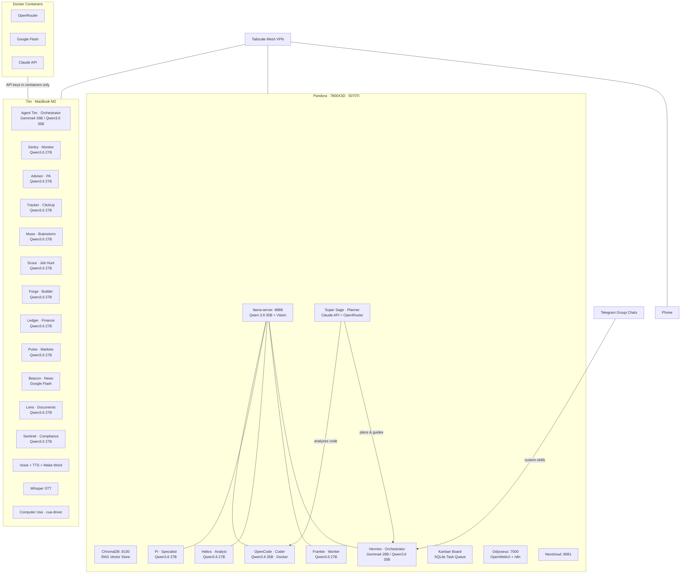

# 🗺️ The Full Journey

How I went from zero code to a multi-machine, multi-agent AI system in under a year.

---

## Prologue: The Beginning (September 2025)
Moved to the UK to start my MBM (Master of Business Management) at Cardiff University. The second I got here, I saw how bad the job market was. The Institute of Student Employers reported 140 applications per graduate vacancy. Graduate hiring fell 8%. A third of all job listings were ghost jobs posted with no intent to hire. I was scared. A degree on its own wasn't going to set me apart. I needed to build something, a marketable skill that most people didn't have.

I had a MacBook air (Tim) that I initially decided to use for Uni work. 

I also had a gaming PC (which I named Pandora): 7800X3D, RTX 5070Ti, 32GB DDR5. Built it for games, not for AI. But it was sitting there doing nothing most of the time.

So I looked at it and thought, let me see what this thing can do.

## Phase 1: The Spark (Late 2025)
Started small. Poked around whatever experimental AI tools were on the internet. Web interfaces, free tiers, anything I could get my hands on. Just seeing what these things could do.

Then I thought, can I run this on my own machine?

Found **LM Studio**. It had a GUI, a chat box right there, no terminal required. Good enough. Installed it, loaded up a tiny model, started chatting.

Had no idea what quantisation meant. Didn't know what context size was. Just typed things and watched responses appear.

Most of what I learnt came from **Reddit**. Searched for my GPU specs, read what other people recommended, copied their configurations, tried them out. "What model runs best on a 5070Ti?" "What quant should I use?" "Why is my context so slow?" Every setting, every decision, learnt from people who'd already figured it out.

But it worked. And I wanted more.

## Phase 2: Control (Late 2025)
LM Studio was great but then I stumbled on Ollama. 
**Ollama** made everything easier to use. Suddenly I could pull any model by name from the terminal and run it instantly.

Went on a tear. Tried **Meta Llama** models. Then **Mistral**. Then **Gemma**. Then **Qwen 3.6**. Every model family felt like opening a different door, each one had its own personality, its own strengths.

This is where the obsession really took hold. Started running models on **both machines simultaneously**, Tim and Pandora, just for the fun of it. Not because I needed to. Because I could. Because it was exciting.

Had something running on Pandora's GPU while Tim chewed through a different model. Two machines, both humming, both thinking. Felt like I'd built something real.

But then I wanted the **power of my desktop with the mobility of my laptop**. Didn't want to be stuck at my desk to use AI. Wanted to use it at college, in lectures, wherever. That's when I discovered **Tailscale**. As long as both machines were on the same tailnet, I could route the endpoint and access Pandora's AI through my laptop, anywhere. WireGuard-based encrypted tunnels, zero config, mesh VPN.

That changed everything. My laptop was no longer limited by its own hardware. It was a window into Pandora's brain.

## Phase 3: Going Deeper (January 2026)
Then **Open Claw** released in January 2026. Was one of the early adopters, no hesitation. Factory-reset Tim, installed Open Claw, started using it. Was bewildered. Shocked, even. This was real. Running a local AI agent on my laptop.

But all of it was still running on local LLMs, models served from LM Studio on Pandora. Tim was just the interface. The brains were always local.

That realization sent me deeper. Watched long-form YouTube videos on AI deployment, Local LLM deployment – that's when I learnt that **LM Studio and Ollama are both built on llama.cpp** underneath. So maybe I should go straight to the source.

Studied **llama.cpp**, every flag, every parameter. I learnt what each flag meant, how to tune performance, read the docs, tried different configurations, broke things, fixed them. Then i moved to learning about GGUF quantisation formats, KV cache management, memory-mapped file I/O, and batch inference tuning.

Then I learnt that on Apple Silicon, **vLLM** works better — PagedAttention for efficient memory management, continuous batching for throughput. So I installed **vLLM on Tim** and suddenly the MacBook wasn't just a terminal. It was a proper inference server with an OpenAI-compatible API endpoint.

- Factory-reset Uni laptop and named it Tim for Open Claw, then pivoted to Hermes
- Installed vLLM on Tim for better Apple Silicon performance
- Studied llama.cpp flags in depth

## Phase 4: Agents (December 2025 onwards)
Tinkered with local models until December, then switched to agentic AI. Discovered **Paperclip** and it changed how I thought about everything. Paperclip lets you run a multi-agent system as a company, with org charts, budgets, governance, and agent roles. That's when I started building **named, specialised agents for every use case**. I carefully planned the whole architecture out, not randomly.

Then I installed Hermes and it became the single biggest milestone in this entire journey. Never worked with agentic systems before. Harnesses that could push commands through the terminal, actually do tasks on the computer. This wasn't just chatting with an AI anymore. This was an AI that could *act*.

As soon as I installed Hermes, I needed more and more performance out of my hardware. So I **disconnected the monitor from the GPU**. No more desktop. The GPU was now free to do nothing but inference. Dual-booted Pandora, tuned every llama.cpp flag I could find, turned the whole thing into a **headless AI server**.

Every agent, every inference, every model — I access it all **through SSH over Tailscale**. Pandora sits in a corner humming away. I never see its screen. I don't need to.

Quickly realized Open Claw was overkill for my use case. So I switched to **Hermes** in February, no research, no hesitation, just went for it.

### Docker

When I installed Hermes, I discovered **Docker**. Realized I could run Hermes as a Docker image, not just install it locally. That changed everything. Started containerising all the coding harnesses — Codex, Open Code, Claude Code — and Hermes itself.

Docker provides process isolation and filesystem sandboxing. API keys for cloud services only live inside containers — they never touch the host machine. When a cloud model is needed, the container handles the API call and processes the response, while the key stays locked inside. Local inference agents never touch an API at all — they run straight off Pandora's GPU via the llama-server endpoint.

The inference split:
- **Hermes instances** (orchestrators) — Gemma 4 26B-A4B or Qwen 3.6 35B-A3B
- **Specialised agents** — dense local models, Qwen 3.6 27B
- **Planner and technical agent** (Super Sage) — Claude API + OpenRouter, inside Docker
- **Briefs and news** — Google Flash API hooked to a Hermes profile, inside Docker

While using Hermes, I started discovering the ecosystem. So many different agents out there, nano claw, small claw, pie claw, this claw, that claw. Every week something new appeared. But Hermes was the one that stuck.

And then I hit a wall: needed **custom skills**. The built-in stuff wasn't enough. Wanted my agents to do specific things, things no one had written a skill for yet.

So I learnt. Properly. Spent **months** just learning. YouTube videos, tutorials, the Claw Hub, experimenting with Hermes day in and day out. I figured out how to write custom skills from scratch, how to package them, chain them, make agents do exactly what I needed. Then I learnt about MCP (Model Context Protocol), function calling, tool use patterns, and prompt engineering for agentic workflows.

### Telegram Group Chats

I have **multiple group chats with my agents on Telegram**. Each group chat is a different agent or team of agents. Hermes handles the routing via custom skills that delegate tasks across the system. I can talk to any agent directly through its own group chat, or let Hermes orchestrate across them. It's a conversational interface to a multi-agent backend — manage everything from your phone.

### The Named Agents

Once Paperclip showed me what structured multi-agent systems could look like, I started naming and scoping every agent for a specific job:

| Agent | Machine | Role | Inference |
|-------|---------|------|-----------|
| **Hermes** | Pandora | Chief Orchestrator. Multi-agent delegation via Telegram group chats and WhatsApp. Task routing, dependency resolution, skill chaining. | Gemma 4 26B-A4B / Qwen 3.6 35B-A3B |
| **Frankie** | Pandora | Worker agent. Picks up tasks from the Kanban queue, executes with tool access, reports results back. | Qwen 3.6 27B |
| **Helios** | Pandora | Analyst. Deep reasoning, research synthesis, complex problem decomposition. | Qwen 3.6 27B |
| **Pi** | Pandora | Specialist. Creative ideation, niche domain tasks, lightweight inference. | Qwen 3.6 27B |
| **OpenCode** | Pandora | Coder. Code review, debugging, refactoring, full development lifecycle. Runs inside Docker. | Qwen 3.6 35B |
| **Super Sage** | Pandora | Strategic planner and troubleshooter. Uses Claude API hooked to Pi agent for deep code analysis, architectural review, and cross-agent guidance. The system's reasoning layer. | Claude API + OpenRouter |
| **Agent Tim** | Tim | Chief Orchestrator on the MacBook. Coordinates across all Tim-based agents, manages local workflows. | Gemma 4 26B-A4B / Qwen 3.6 35B-A3B |
| **Sentry** | Tim | Monitoring agent. System health checks, alert routing, watchdog tasks. | Qwen 3.6 27B |
| **Advisor** | Tim | PA agent. Meeting transcription, MoM generation, schedule management. | Qwen 3.6 27B |
| **Tracker** | Tim | Project management. ClickUp integration, task tracking, sprint planning. | Qwen 3.6 27B |
| **Muse** | Tim | Creative agent. Ideation, brainstorming, content generation. | Qwen 3.6 27B |
| **Scout** | Tim | Job market agent. Vacancy scanning, application tracking, market analysis. | Qwen 3.6 27B |
| **Forge** | Tim | Infrastructure agent. Deployment automation, server management, CI/CD pipelines. | Qwen 3.6 27B |
| **Ledger** | Tim | Finance agent. Budgeting, expense tracking, financial analysis. | Qwen 3.6 27B |
| **Pulse** | Tim | Market intelligence. Global markets, trend analysis, data synthesis. | Qwen 3.6 27B |
| **Beacon** | Tim | News agent. RSS aggregation, summarisation, daily briefings via Google Flash. | Google Flash API |
| **Lens** | Tim | Document analysis. PDF parsing, report generation, information extraction. | Qwen 3.6 27B |
| **Sentinel** | Tim | Compliance agent. Regulatory monitoring, policy analysis, audit trails. | Qwen 3.6 27B |

Each one runs locally or through Docker containers. Hermes delegates through Telegram group chats, Frankie executes, Helios reasons, Super Sage thinks and plans, Scout hunts, Advisor schedules, Beacon reads the news. Not one AI doing everything. A system of specialists.

### Building the Skills

Since Hermes already had **Telegram and WhatsApp** configured, I wrote **custom skills to let Hermes delegate tasks to the other agents**. Not just dispatching, real orchestration, skills for coordinating multiple agents on a single task, skills for "sponsoring" agents, spinning one up for a specific job and pulling results back.

That's when I stumbled into **Kanban boards**. I realized that I could use them to manage agent workflows — visual queues of what's running, what's done, what's blocked, SQLite-backed task queue with dependency chaining.
I started using Kanban boards for my agents alongside learning more and more about **n8n** for workflow automation pipelines.

But then realized something: agentic systems like Hermes were great for general tasks, but for **strictly coding**, I needed something purpose-built. Something within the scope of actual software development.

So I installed **Codex**, **Open Code**, and **Claude Code**, one by one, hooking them all up to my local AI Server. I benchmarked them one by one, testing which one could actually write code, review PRs, and handle real development workflows. 

That's when I stopped being a user and started being someone who could evaluate tools. Before I knew it, I wasn't just following tutorials anymore, I was making informed decisions about what worked and what didn't.

## Phase 5: Self-Hosting & Bots (Mid 2026)
Now I run everything myself:

| Service | What it does |
|---------|-------------|
| llama-server | Local LLM serving — Qwen 3.6 35B (GGUF, quantised) + Qwen 3.5 9B Vision |
| ChromaDB | Vector store for RAG pipelines |
| Odysseus | OpenWebUI + n8n workflow automation |
| Nextcloud | Decentralised file sync |
| Kanban Board | SQLite-backed multi-agent task queue |
| 6x Agents on Pandora | Hermes, Frankie, Helios, Pi, OpenCode, Super Sage |
| 11x Agents on Tim | Agent Tim, Sentry, Advisor, Tracker, Muse, Scout, Forge, Ledger, Pulse, Beacon, Lens, Sentinel |
| Tailscale | WireGuard mesh VPN connecting all machines |

- Started building RAG bots that could answer questions from uploaded documents, my project codebases, etc.
- Pipeline: document ingestion → chunking → embedding generation → ChromaDB storage → retrieval → LLM synthesis

## Phase 6: The Full Stack (Mid-Late 2026)
Everything accelerated. Multiple bots, voice, transcription, autonomous agents.

**Tim gets a workforce upgrade:**
- **Multiple Hermes profiles**, each with a role
- **Voice interface** — Edge TTS + wake word detection
- **Live transcription** — 2ch audio routing + Whisper STT
- **Meeting pipeline** — Microsoft Teams VTT transcript parsing → structured MoM documents
- **Computer use** — Background desktop automation via cua-driver (click, type, scroll, screenshot)
- **Browser automation** — Browser Use for web interaction tasks
- **Apple ecosystem integrations** — Notes, Reminders, iMessage, Find My via native CLIs

**Pandora grows into a consultancy:**
- All specialised agents run on Qwen 3.6 27B
- Hermes instances use Gemma 4 26B-A4B or Qwen 3.6 35B-A3B
- Planner and technical agent use Claude API + OpenRouter
- Briefs and news come from Google Flash API

## Phase 7: First Real Project (Late 2026)
My Uni professor at Cardiff gave me my first real opportunity: **build a WhatsApp RAG bot for him**. The Professor has a lot of colleagues, CEOs and industry experts, who ask him about his work and concepts from his published consulting books. He wanted that automated. That's what I built.

The stack: **Twilio** webhook → **Node.js** bridge → **FastAPI** RAG API → **ChromaDB** vector store → local LLM inference. Document ingestion pipeline handles PDFs, chunking, embedding generation, and semantic search.

I used my **multi-agent system** to pull it off. Hermes coordinated, agents ran inference, the pipeline handled embeddings and retrieval. It worked. It was the greatest experience of my life. learnt more from that one project than from months of experimentation.

Everything I'd built, the headless server, the Tailscale mesh, the custom skills, the Kanban boards — all came together for a real deliverable.

My first project in he UK is now in demo mode. Built entirely on local AI, without spending any money on AI subscriptions, while keeping my data safe and private.

## The Stack Today

## Lessons
- **You don't need code to start.** GUI tools (LM Studio) are good enough for discovery.
- **One GPU is enough to begin.** A 5070Ti runs 9-35B models comfortably.
- **Reddit is your first teacher.** Every config, every setting, someone already figured it out.
- **Ollama changes the game.** Pull any model by name, run it instantly.
- **Try everything.** Llama, Mistral, Gemma, Qwen, each model family teaches you something different.
- **Running two machines at once is fun.** Not always practical, but always exciting.
- **Tailscale makes it mobile.** Your desktop's power, anywhere you go.
- **SSH + Tailscale open every door.** Two machines feel like one.
- **Headless is the way.** Disconnect the monitor, dedicate the GPU to inference.
- **Docker keeps things safe.** API keys stay in containers, never on the host.
- **Paperclip changes how you think about agents.** Named agents with jobs feel different than anonymous workers.
- **Every agent needs a brain behind it.** Super Sage with Claude API changed how I do code analysis.
- **Custom skills change everything.** Once you can write your own, the possibilities multiply.
- **Telegram group chats make it real.** Talking to agents through chat feels like having a team.
- **Self-hosting is addictive.** Once you control everything, you don't want to go back.
- **Voice changes everything.** Talking to your agent feels different than typing.
- **Local AI is enough.** No cloud APIs needed when your GPU does the work.
- **Real projects teach the most.** One deliverable beats a hundred experiments.
- **Fear is a good motivator.** Being scared of the job market made me build something real.

## What's Next
- Immich (photo management), finally setting it up
- SMB file sharing between machines
- More n8n automation workflows
- Agent-to-agent communication across Tim and Pandora
- Paperclip integration, structured multi-agent company
- Whatever I learn next

---

*Started with a gaming PC, a scared student, and a question. Ended up here.*
