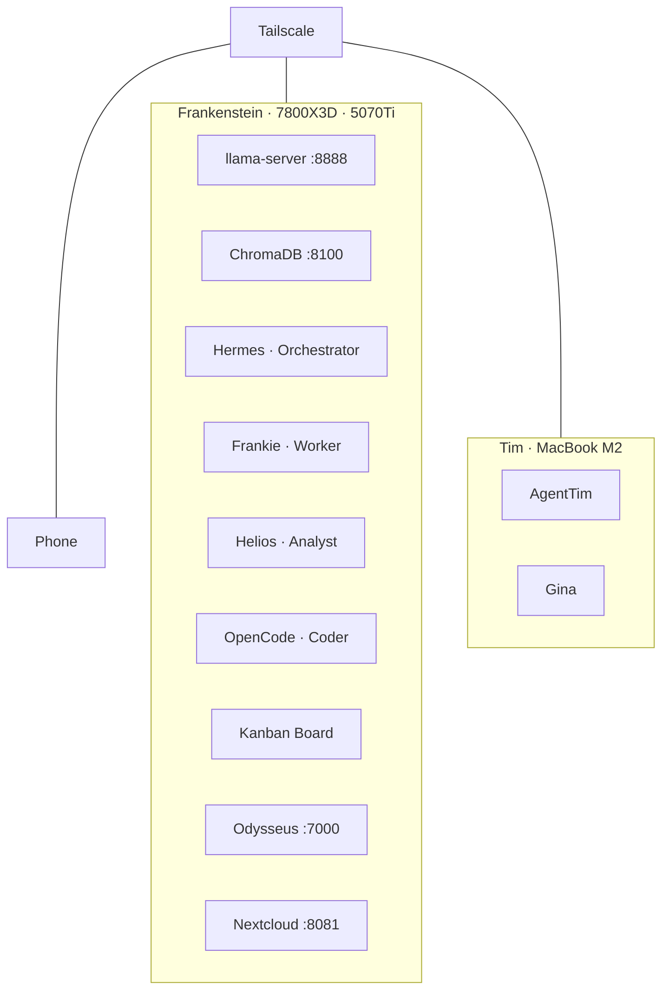

# 🗺️ The Full Journey

How I went from zero code to a multi-machine AI system in half a year.

---

## Prologue (Before AI)

I built a PC for gaming. 7800X3D, RTX 5070Ti, 32GB DDR5 — I wanted to play games from 2008-2009 that my old laptop couldn't run. That was it. No AI ambitions.

I have a bachelor's in **psychology**. I knew nothing about coding. Nothing about LLMs. Nothing about any of this.

## Phase 1: The Spark (Late 2025/Early 2026)

Someone mentioned that GPU is good for AI. Not just gaming — actual AI. I had a 5070Ti sitting there. It felt like a waste not to try.

- Downloaded **Ollama**
- Ran a 7B model
- Had no idea what was happening but it worked

I didn't know what quantization was. I didn't know what context meant. I just typed things and they appeared.

## Phase 2: Control (Early 2026)

Ollama was fine but I wanted to understand what was happening under the hood.

- Moved to **LM Studio**
- Discovered I could control: threads, context size, quantization, accuracy settings
- Started running 9B models
- Realized LM Studio could launch Ollama as a backend
- This blew my mind — I had been using two things that did the same job without knowing it

I still had no coding experience. I just used the GUI sliders and read the numbers.

## Phase 3: Growth (Mid-2026)

I started wanting more. Bigger models. More control. More machines.

- Upgraded to larger quantized models (Q4_K_M, then Q3_K_XL)
- Discovered llama.cpp
- Bought **Tim** (MacBook Air M2) as a second machine for agents
- Set up **Tailscale** — everything connected

I didn't know what I was doing. I just kept trying things until they worked.

## Phase 4: Agents (Mid-2026)

This is where it got interesting.

- First **Hermes Agent** deployment on Frankenstein
- Learned about MCP, Kanban boards, multi-agent orchestration
- Created **AgentTim** on the MacBook
- **Gina** profile for daily briefings
- Multi-agent Kanban pipeline: Hermes → Frankie → Helios → OpenCode
- Parallel task execution, dependency chaining, checkpoint analysis

I started using terms I'd never heard of six months ago. "Decompose the goal." "Dependency graph." "Checkpoint analysis." I had no idea I'd be saying these things.

## Phase 5: Self-Hosting (Current)

Now I run everything myself:

| Service | What it does |
|---------|-------------|
| llama-server | Qwen3.6-35B + Qwen3.5-9B Vision |
| ChromaDB | Vector store for RAG |
| Odysseus | OpenWebUI + n8n automation |
| Nextcloud | File sync |
| Kanban Board | Multi-agent orchestration |
| 4× Agents | Hermes, Frankie, Helios, OpenCode |
| Tailscale | All machines connected |

## The Stack Today

## Lessons

- **You don't need code to start.** GUI tools (Ollama, LM Studio) are good enough for discovery.
- **One GPU is enough to begin.** A 5070Ti runs 9-35B models comfortably.
- **SSH + Tailscale open every door.** Two machines feel like one.
- **Multi-agent orchestration is real.** Kanban boards + dispatchers + worker profiles work.
- **Self-hosting is addictive.** Once you control everything, you don't want to go back.

## What's Next

- Immich (photo management)
- SMB file sharing between machines
- More automation via n8n
- Whatever I learn next

---

*Started with a gaming PC and a question. Ended up here.*
