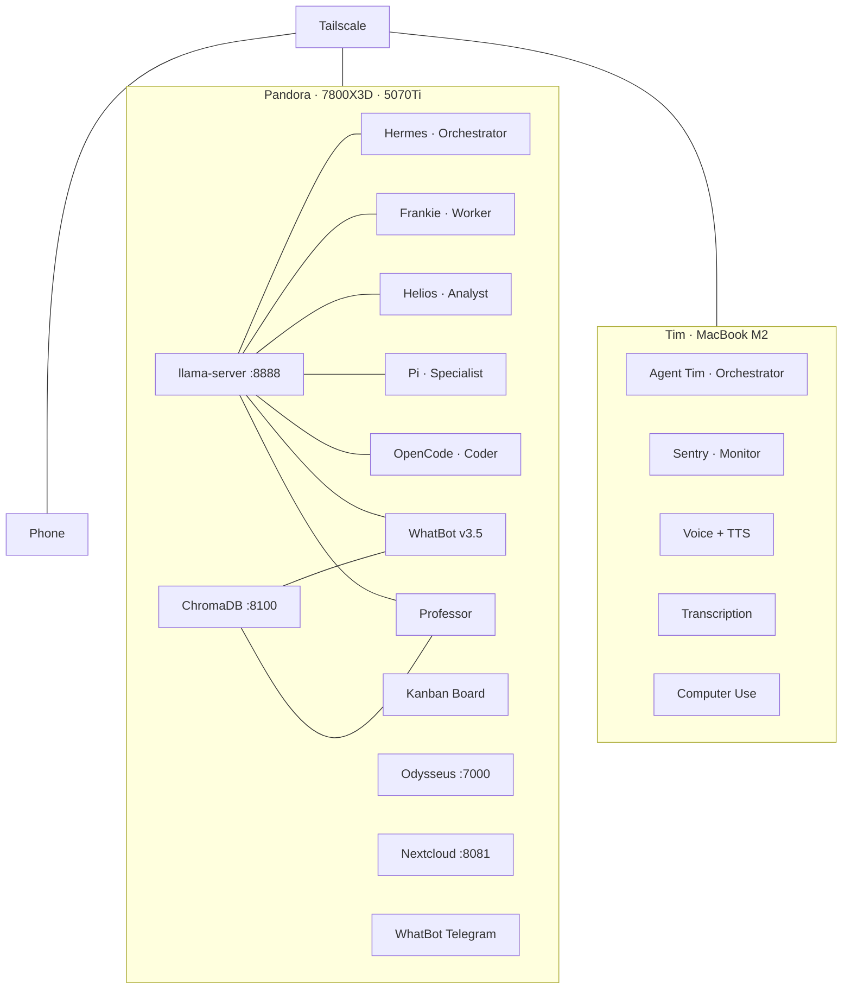

# 🗺️ The Full Journey

How I went from zero code to a multi-machine, multi-agent AI system in under a year.

---

## Prologue: The Beginning (September 2025)
I came to the UK to start my degree at Cardiff University. That's where it started — not with a fascination for AI, but with a realization. I quickly understood that a degree alone wasn't going to be enough. I needed to upskill myself, to learn something practical alongside the academic side.

I had come here with a gaming PC — 7800X3D, RTX 5070Ti, 32GB DDR5. Built it for games, not for AI. But it was sitting there, powerful hardware just waiting to be used for something more.

So I thought — okay, let's try learning about AI.

## Phase 1: The Spark (Late 2025 / Early 2026)
It started small. I'd use whatever experimental AI tools were available on the internet — web interfaces, free tiers, anything I could get my hands on. Just poking around, seeing what these things could do.

Then I thought — can I run this locally? On my own machine?

I found **LM Studio**. It had a GUI, a chat box right there, no terminal required. That was enough for me to try. I installed it, loaded up a tiny model, and started chatting.

I had no idea what quantization was. I didn't know what context meant. I just typed things and watched responses appear.

Most of what I learned came from **Reddit**. I'd search for my GPU specs, read what other people recommended, copy configurations, try them out. "What model runs best on a 5070Ti?" "What quant should I use?" "Why is my context so slow?" Everything — every setting, every decision — I learned from people who already figured it out. I was completely dependent on the internet's help.

But it worked. And I wanted more.

## Phase 2: Control (Early 2026)
LM Studio was great but I wanted more. I discovered **Ollama** — and that changed everything. Suddenly I had a proper way to run models from the terminal, pull them by name, switch between them instantly.

I went on a tear. I tried **Meta Llama** models. Then **Mistral**. Then **Gemma**. Then **Qwen 3.6**. Every new model family felt like opening a different door — each one had its own personality, its own strengths.

This is where the obsession really took hold. I started running models on **both machines simultaneously** — Tim and Pandora — just for the sake of it. Not because I needed to. Because I was an enthusiast. Because it was exciting. Because I could.

I'd have something running on Pandora's GPU while Tim chewed through a different model. Two machines, both humming, both thinking. It felt like I had built something.

But then I wanted the **power of my desktop with the mobility of my laptop**. I didn't want to be stuck at my desk to use AI. I wanted to use it at college, in lectures, wherever. That's when I discovered **Tailscale**. As long as both machines were on the same tailnet, I could route the endpoint and access the AI running on Pandora's GPU through my laptop, anywhere.

That changed everything. My laptop was no longer limited by its own hardware — it was a window into Pandora's brain.

## Phase 3: Going Deeper (Mid-2026)
Then **Open Claw** released. I was one of the early adopters — no hesitation. I factory-reset Tim, installed Open Claw, and started using it. I was bewildered. Shocked, even. This was real. I was running a local AI agent on my laptop.

But all of it was still running on local LLMs — models served from LM Studio on Pandora. Tim was just the interface. The brains were always local.

That realization sent me deeper. I watched long-form YouTube videos on AI deployment, LLM deployment. That's when I learned that **LM Studio and Ollama are both built on llama.cpp** underneath. So maybe I should go straight to the source.

I studied **llama.cpp** — every flag, every parameter. What each flag meant, how to tune performance. I read the docs, tried different configurations, broke things, fixed them.

Then I learned that on Apple Silicon, **vLLM** works better. So I installed **vLLM on Tim** and suddenly the MacBook wasn't just a terminal — it was a proper inference server.

- Bought **Tim** (MacBook Air M2) as a second machine
- Factory-reset Tim for Open Claw, then pivoted to Hermes
- Installed vLLM on Tim for better Apple Silicon performance
- Studied llama.cpp flags in depth

## Phase 4: Agents (Mid-2026)
As soon as I installed Hermes, I needed more and more performance out of my hardware. So I **disconnected the monitor from the GPU**. No more desktop — the GPU was now free to do nothing but inference. I dual-booted Pandora, tuned every llama.cpp flag I could find, and turned the whole thing into a **headless AI server**.

Every agent, every inference, every model — I access it all **through SSH over Tailscale**. Pandora sits in a corner humming away. I never see its screen. I don't need to.

I quickly realized Open Claw was overkill for my use case. So I switched to **Hermes** — no research, no hesitation, just went for it.

**Hermes was the single biggest milestone in this entire journey.** I had never worked with agentic systems before — harnesses that could push commands through the terminal, actually do tasks on the computer. This wasn't just chatting with an AI anymore. This was an AI that could *act*.

While using Hermes, I started discovering the ecosystem. There were so many different agents out there — nano claw, small claw, pie claw, this claw, that claw. Every week something new appeared. But Hermes was the one that stuck.

And then I hit a wall: I needed **custom skills**. The built-in stuff wasn't enough. I wanted my agents to do specific things — things no one had written a skill for yet.

So I learned. Properly. I spent **two months** just learning — YouTube videos, tutorials, the Claw Hub, experimenting with Hermes day in and day out. I figured out how to write custom skills from scratch. How to package them, how to chain them, how to make agents do exactly what I needed.

- First **Hermes Agent** deployment on Pandora
- Learned about MCP, Kanban boards, multi-agent orchestration
- Spent two months learning through YouTube, tutorials, Claw Hub
- Figured out how to make custom skills
- Discovered Pi Agent, set it up alongside Hermes
- Custom skills for agent delegation and orchestration
- Kanban boards for agent workflow management
- Started learning n8n for automation pipelines
- Created **AgentTim** on the MacBook
- Multi-agent Kanban pipeline: Hermes → Frankie → Helios → OpenCode
- Parallel task execution, dependency chaining, checkpoint analysis

I went from copying Reddit configurations to writing my own agent skills. Six months earlier I didn't know what a terminal was. Now I was building autonomous systems.

But then I realized something: agentic systems like Hermes were great for general tasks, but for **strictly coding**, I needed something purpose-built. Something in the scope of actual software development.

So I installed **Codex**, **Open Code**, and **Claude Code** — all three at once. Hooked them all up to my local AI. Started benchmarking them side by side, testing which one could actually write code, review PRs, and handle real development workflows. Running all three simultaneously, comparing outputs, finding strengths and weaknesses.

That's when I stopped being a user and started being someone who could evaluate tools. I wasn't just following tutorials anymore — I was making informed decisions about what worked and what didn't.

Then I discovered **Pi Agent** — another specialist model. I set up Pi alongside everything else and made them all work together.

Since Hermes already had **Telegram and WhatsApp** configured for me, I wrote **custom skills to let Hermes delegate tasks to the other agents**. Not just dispatching — real orchestration. Skills for coordinating multiple agents on a single task. Skills for "sponsoring" agents — spinning one up for a specific job and pulling results back.

That's when I stumbled into **Kanban boards**. I realized I could use them to manage agent workflows — visual queues of what's running, what's done, what's blocked. Started using Kanban boards for my agents alongside learning more and more about **n8n** for automation pipelines.

## Phase 5: Self-Hosting & Bots (July 2026)
Now I run everything myself:

| Service | What it does |
|---------|-------------|
| llama-server | Local LLMs — Qwen 3.6 35B + Qwen 3.5 9B Vision |
| ChromaDB | Vector store for RAG |
| Odysseus | OpenWebUI + n8n automation |
| Nextcloud | File sync |
| Kanban Board | Multi-agent orchestration |
| 5× Agents | Hermes, Frankie, Helios, Pi, OpenCode |
| Tailscale | All machines connected |

- **WhatBot v1** — first WhatsApp document assistant
- Started building bots that could answer questions from uploaded files
- RAG pipeline: documents → embeddings → ChromaDB → answers

## Phase 6: The Full Stack (August 2026)
Everything accelerated. Multiple bots, voice, transcription, autonomous agents.

**WhatsApp Bots:**
- WhatBot evolved to **v3.5** — multi-format QA (PDFs, Word, Excel, images)
- **Professor** — RAG-powered research bot. Upload arXiv papers, get grounded answers.
- **WhatBot Telegram** — research assistant on Telegram

**Tim gets serious:**
- **Multiple Hermes profiles** — each with a role:
  - Agent Tim — orchestrator
  - Sentry — monitoring and watchdog
  - Plus others for specialised tasks
- **Voice** — TTS + wake word detection
- **Live transcription** — BlackHole audio routing + Whisper STT
- **Meeting pipeline** — Teams VTT transcripts → Minutes of Meeting documents
- **Computer use** — background desktop control (clicking, typing, screenshots)
- **Browser automation** — web tasks
- **Apple integrations** — Notes, Reminders, iMessage, Find My

**Pandora grows:**
- **Pi agent** added — specialist tasks
- All agents dynamically switch between Qwen 3.6 and Gemma 4 based on task type
- Reasoning-heavy workloads go to the bigger model, fast tasks stay light

**GitHub projects growing:**
- 6 repos total across bots and architecture docs
- Each bot has its own repo with proper README

## The Stack Today

## Lessons
- **You don't need code to start.** GUI tools (LM Studio) are good enough for discovery.
- **One GPU is enough to begin.** A 5070Ti runs 9-35B models comfortably.
- **Reddit is your first teacher.** Every config, every setting — someone already figured it out.
- **Ollama changes the game.** Pull any model by name, run it instantly.
- **Try everything.** Llama, Mistral, Gemma, Qwen — each model family teaches you something different.
- **Running two machines at once is fun.** Not always practical, but always exciting.
- **SSH + Tailscale open every door.** Two machines feel like one.
- **Multi-agent orchestration is real.** Kanban boards + dispatchers + worker profiles work.
- **Self-hosting is addictive.** Once you control everything, you don't want to go back.
- **Bots multiply fast.** WhatBot v1 → v3.5, Professor, Telegram bot — all in a month.
- **Voice changes everything.** Talking to your agent feels different than typing.
- **Local AI is enough.** No cloud APIs needed when your GPU does the work.

## What's Next
## Phase 7: First Real Project & Paperclip (Late 2026)
My professor at Cardiff gave me my first real opportunity — **curate a custom AI solution for him**. A WhatsApp RAG bot. A real project with a real client, not just tinkering.

I used my **multi-agent system** to pull it off. Hermes coordinated. The agents ran inference. The pipeline handled embeddings and retrieval. It worked. It was the greatest experience of my life. I learned more from that one project than from months of experimentation.

Everything I'd built — the headless server, the Tailscale mesh, the custom skills, the Kanban boards — it all came together for a real deliverable.

Then I discovered **Paperclip**. An open-source project that lets you run your multi-agent system as a **company** — with org charts, budgets, governance, agent roles, and goal alignment. You're not just dispatching tasks anymore. You're managing an AI workforce. Claude Code, Codex, Hermes, custom scripts — Paperclip organizes them into a functioning hierarchy.

That's where I am now. Taking everything I've learned and scaling it into something structured, governed, and real.

## What's Next
- Immich (photo management) — finally setting it up
- SMB file sharing between machines
- More n8n automation workflows
- Agent-to-agent communication across Tim and Pandora
- Whatever I learn next

---

*Started with a gaming PC, a new country, and a question. Ended up here.*
