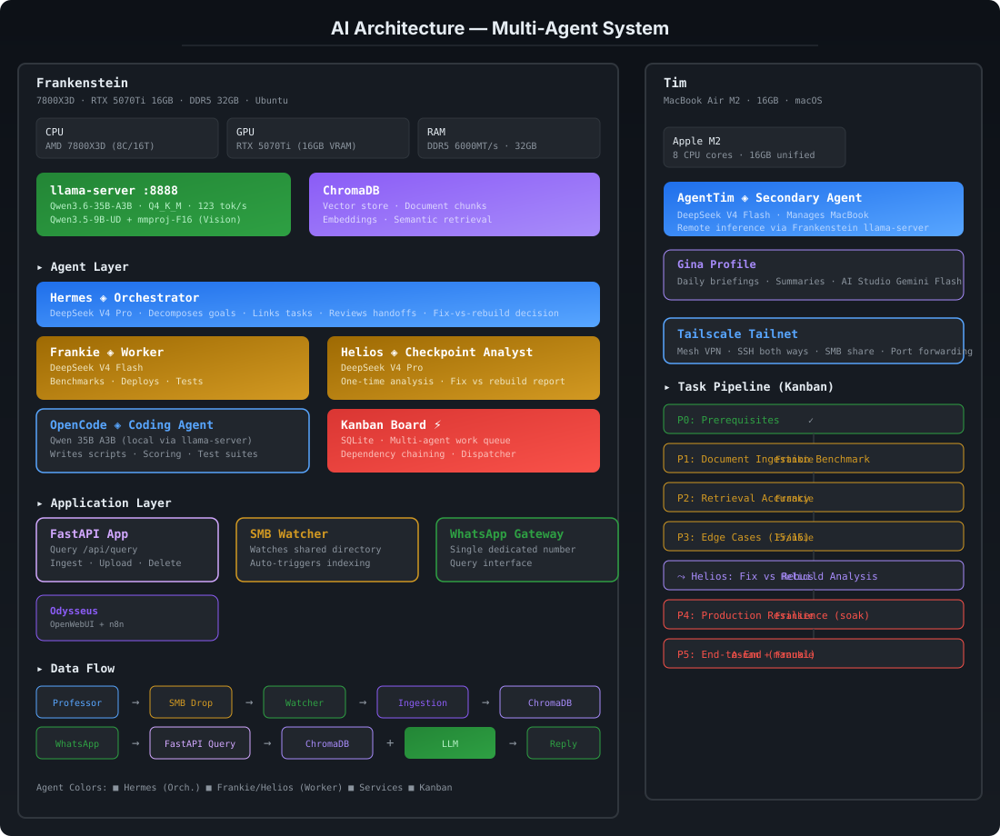

# 🏗️ My AI Journey

> From zero code to a multi-machine, multi-agent AI system — this repo tracks every step.

I came to the UK to start my MBM (Master of Business Management) at Cardiff University. Second I got here, I saw how bad the job market was. A King's College paper had just come out showing every vacancy gets 280 to 300 applications, and some of those vacancies aren't even real. I was scared. A degree on its own wasn't going to set me apart. I needed to build something, a marketable skill that most people didn't have. So I looked at the gaming PC I'd brought with me and thought, let me see what this thing can do.

That curiosity turned into a year of tinkering, breaking stuff, learning, and building things I didn't know were possible. This repo is the map of that journey.

---

## The Path

```
Phase 1  ──  Gaming PC → "wait, this GPU is good for AI?"
Phase 2  ──  LM Studio → Ollama → Tailscale → mobility
Phase 3  ──  Open Claw → llama.cpp → vLLM → going deeper
Phase 4  ──  Hermes → Docker → custom skills → agents → Kanban → n8n
Phase 5  ──  Self-hosting everything → bots → full stack
Phase 6  ──  Voice, vision, transcription, autonomous agents
Phase 7  ──  First real project → Paperclip → structured AI company (you are here)
```

---

## Today's Architecture



**Two machines, one tailnet, a bunch of named local AI agents, and way too many containers.**

| Machine | Specs | What it does |
|---------|-------|-------------|
| **Pandora** | 7800X3D · RTX 5070Ti · 32GB · Ubuntu | All inference, all agents, all services |
| **Tim** | MacBook Air M2 · 16GB · macOS | Portable agent host, voice, transcription |

### How Inference Works

Not everything runs on local hardware. The setup is split by role:

- **Orchestrators and managers** (Hermes, Agent Tim, Frankie, Helios, etc.) — local AI on Pandora's GPU
- **Coders** (OpenCode) — local AI on Pandora's GPU
- **Specialised agents** (Scout, Advisor, Muse, Beacon, etc.) — OpenRouter or Google Flash API

API keys live exclusively inside Docker containers. That way the agents get the flexibility of cloud models for lightweight tasks, but the keys and data stay isolated. Docker was a game changer when I discovered it during the Hermes install, more on that below.

### Pandora

| Category | Service | Details |
|----------|---------|---------|
| Inference | llama-server `:8888` | Local LLMs, Qwen 3.6 35B + Qwen 3.5 9B Vision |
| Vector DB | ChromaDB `:8100` | RAG embeddings for bots and agents |
| Board | Kanban | SQLite multi-agent queue |
| Workspace | Odysseus `:7000` | OpenWebUI + n8n automation |
| Self-hosted | Nextcloud `:8081` | File sync |
| Self-hosted | Immich | Photo management (planned) |

### Named Agents

| Agent | Machine | Role | Inference |
|-------|---------|------|-----------|
| **Hermes** | Pandora | Chief Orchestrator, delegates tasks via Telegram/WhatsApp | Local (Qwen 3.6 35B) |
| **Frankie** | Pandora | Worker, handles queued tasks from Kanban board | Local (Qwen 3.6) |
| **Helios** | Pandora | Analyst, deep reasoning and research | Local (Qwen 3.6 35B) |
| **Pi** | Pandora | Specialist, creative and niche tasks | Local (Gemma 4 12B) |
| **OpenCode** | Pandora | Coder, code review, debugging, building | Local (Qwen 3.6 35B) |
| **Super Sage** | Pandora | Strategic planner, troubleshooter, code analyst. Uses Claude API hooked to Pi agent for deep code analysis. Guides all other agents. | Claude API + Gemma 4 12B |
| **Agent Tim** | Tim | Chief Orchestrator on MacBook, multi-agent coordination | Local (Qwen 3.6 / Gemma 4) |
| **Sentry** | Tim | Monitor, alerts, watchdog tasks | OpenRouter / Google Flash |
| **Advisor** | Tim | PA agent, meeting minutes, schedule management | OpenRouter / Google Flash |
| **Tracker** | Tim | ClickUp agent, task and project tracking | OpenRouter / Google Flash |
| **Muse** | Tim | Brainstorm agent, creative ideation | OpenRouter / Google Flash |
| **Scout** | Tim | Job agent, job hunting, applications, market scanning | OpenRouter / Google Flash |
| **Forge** | Tim | Builder agent, infrastructure, deployments, automation | Local (Qwen 3.6 / Gemma 4) |
| **Ledger** | Tim | Finance agent, personal finances, budgeting | OpenRouter / Google Flash |
| **Pulse** | Tim | Market agent, global markets, trends, analysis | OpenRouter / Google Flash |
| **Beacon** | Tim | News agent, global news aggregation and summaries | OpenRouter / Google Flash |
| **Lens** | Tim | Document agent, document analysis, report generation | OpenRouter / Google Flash |
| **Sentinel** | Tim | Compliance agent, industry compliance, regulatory checks | OpenRouter / Google Flash |

### Tim Capabilities
- Voice TTS + wake word detection ("Agent Tim")
- Live meeting transcription (BlackHole + Whisper)
- Meeting pipeline (VTT transcripts to MoM documents)
- Computer use (background desktop control)
- Browser automation
- Apple integrations (Notes, Reminders, iMessage, Find My)

### Docker

I discovered Docker when I installed Hermes for the first time. Realized I could run Hermes as a Docker image, not just locally. That changed everything. Started running all the coding harnesses (Codex, Open Code, Claude Code) and Hermes itself inside Docker containers. Keeps files safe and secure from AI APIs. API keys only live inside containers, never on the host machine.

All connected over **Tailscale**. I access everything through SSH, even from my laptop at college.

---

## The Full Story

See **[JOURNEY.md](JOURNEY.md)** for the complete timeline, from running my first 7B model in LM Studio to debugging multi-agent Kanban pipelines at 2am.

---

## Highlights

- **September 2025** — Moved to the UK for my MBM at Cardiff. Saw the job market. 280-300 applications per vacancy. Got scared. Decided to build a marketable skill.
- **February 2026** — First GGUF download. Had zero idea what a "quant" was. Learned everything from Reddit.
- **March 2026** — Discovered Paperclip. Started building named, specialised agents for every use case.
- **March 2026** — Discovered I could control context size. Mind blown.
- **April 2026** — Open Claw released. Factory-reset Tim, installed it immediately. Early adopter.
- **May 2026** — Open Claw was overkill. Switched to Hermes. Discovered Docker. Dived into llama.cpp flags, installed vLLM on Tim.
- **May 2026** — Disconnected the monitor from the GPU. Turned Pandora into a headless AI server. All access via SSH over Tailscale.
- **May to July 2026** — Hermes became the biggest milestone. Two months learning agentic systems, custom skills, Claw Hub. Built autonomous multi-agent pipelines.
- **July 2026** — Self-hosted services live (Nextcloud, Odysseus). First WhatsApp bot deployed.
- **August 2026** — AskJoe bot built for Professor Joe O'Mahoney. WhatsApp RAG bot answering questions from his published consulting work. In demo mode with the client now.
- **September 2026** — Architecture docs rewritten. Full agent stack documented.

---

## Projects

| Repo | What it does |
|------|-------------|
| [AskJoe](https://github.com/stopabidi/ai-architecture) | WhatsApp RAG bot for Professor Joe O'Mahoney's consulting work |
| [Professor](https://github.com/stopabidi/professor-whatsapp-bot) | RAG-powered arXiv research bot |
| [AI Architecture](https://github.com/stopabidi/ai-architecture) | This repo, system docs and diagrams |

---

*Started with a gaming PC, a scared student, and a question. Ended up here.*
